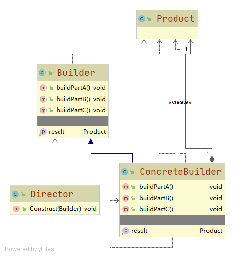
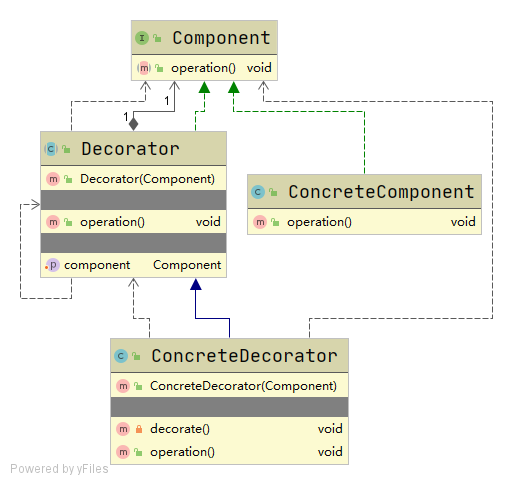
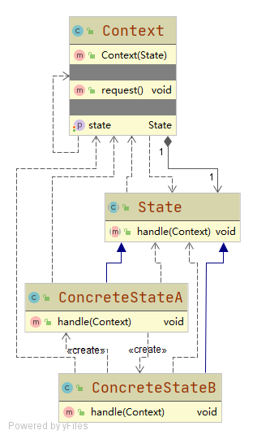
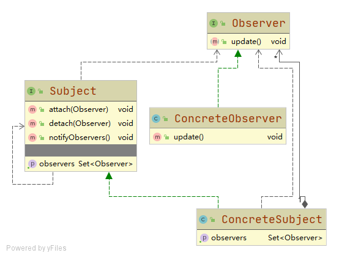
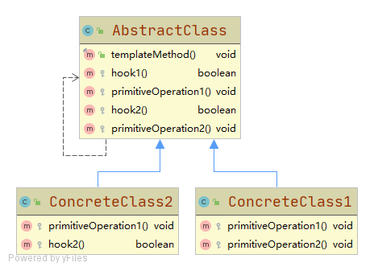

# 设计模式

## 创建型

### [简单工厂模式](./simple-factory)
- [计算器](./simple-factory/src/main/java/calculator)

### [工厂方法模式](./factory-method)
- [日志记录器](./factory-method/src/main/java/logger)

### [抽象工厂模式](./abstract-factory)
- [切换数据库](./abstract-factory/src/main/java/database)

### [建造者模式](./builder)

- [电脑组装](./builder/src/main/java/computer)

### [单例模式](./singleton)

## 结构型

### [装饰模式](./decorator)

- [饮品调配](./decorator/src/main/java/drink)

## 行为型

### [策略模式](./strategy)
- [收银台](./strategy/src/main/java/cashier)

### [状态模式](./state)

- [电梯](./state/src/main/java/lift)

### [观察模式](./observer)

- [公众号订阅](./observer/src/main/java/accounts)
- [EventBus](./observer/src/main/java/eventbus)

### [模板方法模式](./template-method)
_
