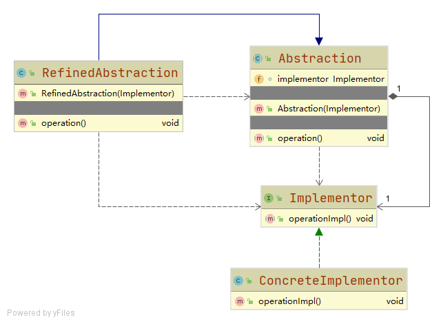

# 桥接模式 Bridge

将抽象部分与它的实现部分分离，使它们都可以独立地变化

## 优点
- 分离抽象接口及其实现部分
- 两个变化维度中任意扩展一个维度
- 实现细节对客户透明

## 缺点
- 增加系统的理解与设计难度，由于聚合关联关系建立在抽象层，要求开发者针对抽象进
行设计与编程
- 需要正确识别出系统中两个独立变化的维度

## 角色
### Abstraction 抽象类
关联（桥接）一个Implementor，声明抽象方法

### RefinedAbstraction 扩充抽象类
继承自Abstraction，实现了抽象方法。它可以调用桥接的Implementor对象中的方法

### Implementor 实现类接口
一个独立发展的维度，声明自己的功能方法，可以被Abstraction类调用。

### ConcreteImplementor 具体实现类
Implementor的具体实现

## 应用

- 跨平台图片解析器，操作系统和图片格式两个维度独立发展，在抽象层关联到一起
