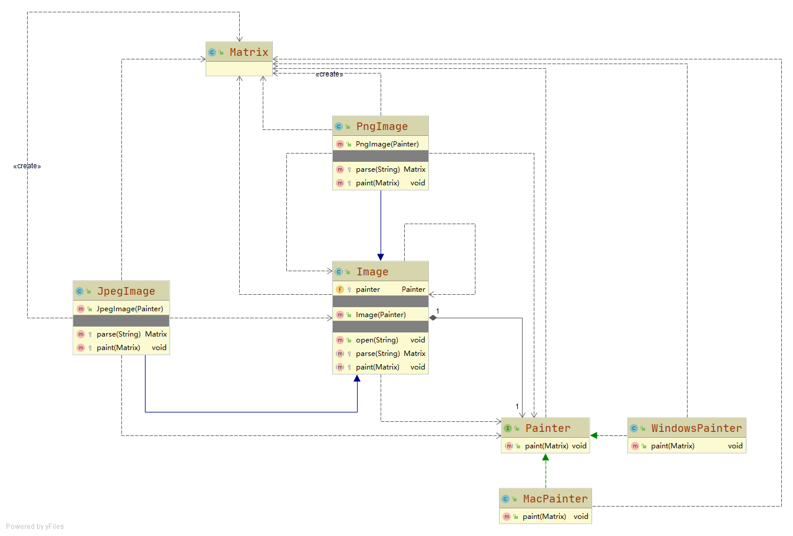

# 跨平台图像浏览器

有两个变化维度：图像格式和操作系统

支持不同格式的图片在不同操作系统的显示

## 设计

### 抽象类 Image
定义了图像的解析和显示，其中图像显示通过桥接一个显示类实现

### 扩充抽象类 PngImage JpegImage
扩充自抽象类，实现不同图像格式的解析

### 实现类接口 Painter
独立扩展的功能，负责在不同操作系统下的显示

### 具体实现类 WindowsPainter MacPainter
实现Painter接口的功能，负责在当前平台下的图像显示功能