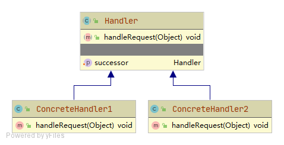

# 职责链 Chain of responsibility

使多个对象都有机会处理请求，从而避免请求的发送者和接收者之间的耦合关系。

将这个对象连成一条链，并沿着这条链传递该请求，直到有一个对象处理它为止。

## 角色

### Handler 处理接口
定义处理请求的方法

### ConcreteHandler 具体处理者
实现具体的请求处理，可以访问后继者successor，若自身不能处理则调用后继者处理

## 优点
- 请求的发送与接收解耦
- 客户端可以灵活地构建出不同的责任链
- 添加Handler不需要修改源代码，复合开闭原则