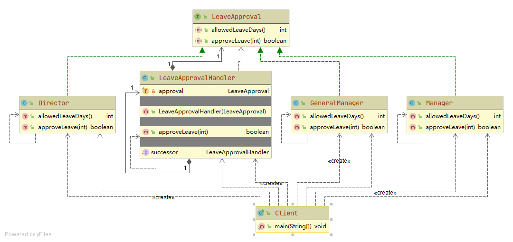

# 请假审批

员工请假天数与审批人：
1. 小于等于3天 - 主任 
1. 小于等于10天 - 经理
1. 小于等于30天 - 总经理
1. 超过30天 - 拒绝

## 设计

### LeaveApproval 
请假审批接口, 每一层领导都实现了该接口

### Director Manager GeneralManager
每一级领导,实现请假审批接口

### LeaveApprovalHandler
组成职责链的节点