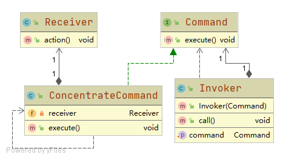

# 命令模式 Command Pattern

将一个请求封装为一个对象，从而使我们可用不同的请求对客户进行参数化

对请求排队或者记录请求日志，以及支持可撤销的操作

## 角色

### Command
抽象命令，通常包含execute()方法执行命令

### ConcreteCommand
具体命令，实现execute()方法，调用接收者完成具体工作

### Receiver
接收者，具体业务处理逻辑

### Invoker
调用者，也即请求发送者。与Command抽象命令关联并执行
