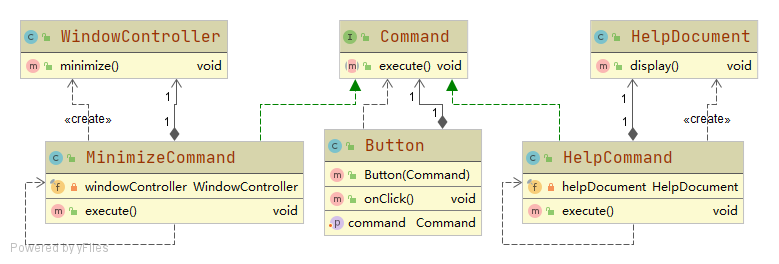

# 按钮控件

按钮onClick()时，自动执行注入的Command，而无需关系具体执行者和执行结果
按钮功能包括：打开帮助文档，最小化窗口

## 设计

### Button
响应onClick(),执行绑定的命令

### Command
命令接口，Button类中注入该接口的实现对象，用于onClick()方法执行

### MinimizeCommand
最小化命令，绑定了窗口管理器用于实现最小化功能

### WindowController
窗口管理器，实现窗口最小化功能

### HelpCommand
帮助命令，执行打开帮助文档

### HelpDocument
帮助文档，可以被显示，供用户查阅