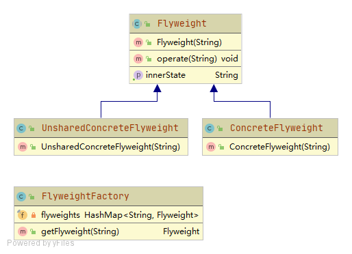

# 享元模式

使用共享技术有效地支持大量细粒度对象的复用

## 角色

### Flyweight 抽象享元类
定义访问内部状态和设置外部状态的方法

### ConcreteFlyweight 具体享元类
实现了抽象享元类，通常由工厂创建

### UnsharedConcreteFlyweight 非共享具体享元类
不需要被共享的对象

### FlyweightFactory 享元工厂类
创建和管理享元对象，内部维持一个共享池
