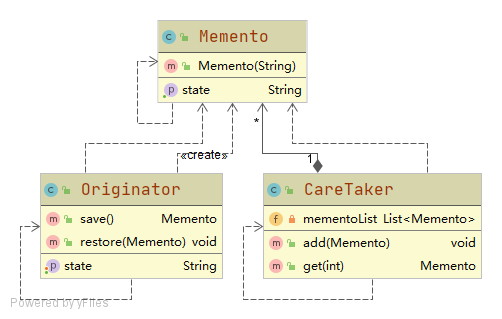

# 备忘录模式

在不破坏封装性的前提下，捕获一个对象的内部状态，并在该对象之外保存这个状态。这样以后就可将该对象恢复到原先保存的状态。

## 角色

### Originator 发起人
需要备份和恢复数据的主体角色

### Memento 备忘录
封装好的,备份的状态

### CareTaker 存档的管理者
与发起人直接交互

## 优点
- 方便地备份与恢复
- 封装了备份信息

## 缺点
- 可能会占用较多的内存资源

## 场景
- 备份+恢复
- 撤销+恢复,例如ctrl+z
- 回滚
