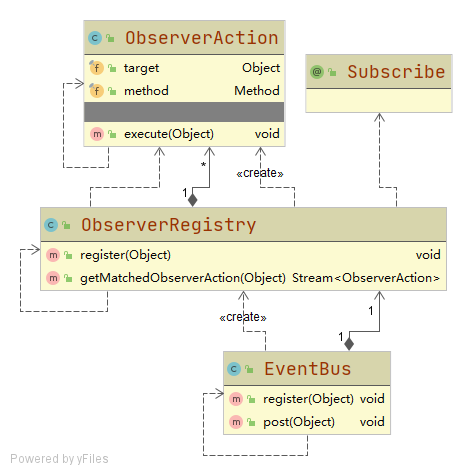

# 事件总线

仿照Google Guava EventBus的一个观察者模式框架

支持同步阻塞和异步非阻塞模式

## 设计

### EventBus

用于注册Object类型的观察者,并向已注册的观察者推送事件

每次推送事件会使用**反射**执行观察类中标注@Subsribe且**参数类型匹配**的方法

### @Subscribe

标注在方法上的注解,用于识别发生通知后,该执行被观察者的哪个方法

### ObserverAction

封装了被调用对象和通知方法, 用于执行反射

### ObserverRegistry

记录了事件类型和对应ObserverAction, 可通过推送的事件,快速查找需要被通知的方法