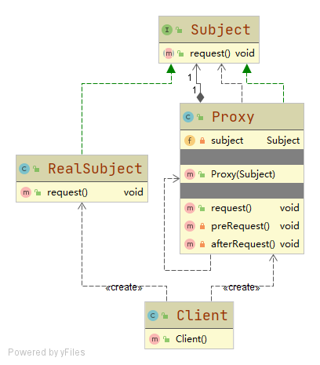

# 代理模式 Proxy

为其他对象提供一种代理以**控制这个对象的访问**

## 角色

### Subject 抽象主题
RealSubject与Proxy的共同接口或父类

### RealSubject 真实主题
被代理的对象，客户端不直接访问

### Proxy 代理主题
与客户端直接交互的对象，内部持有RealSubject

## 动态代理 Dynamic
不需事先编写代理类，在运行时动态地创建代理类，然后在系统中用代理类替换掉原始类

实现方式有：
- JDK Proxy.newProxyInstance();
- Cglib

## 应用

- 业务中的非功能需求：日志、监控、事务、统计等场景

- RPC, 代理负责与远程服务器的交互细节，用户只需要像调用本地函数一样调用代理即可

- Spring AOP