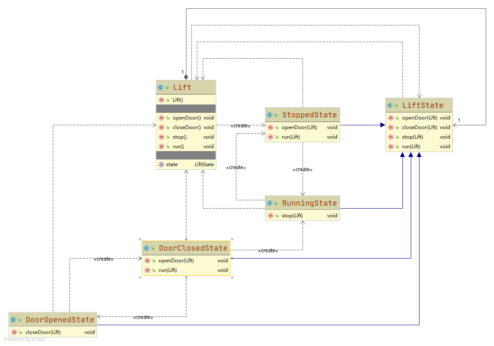

# 电梯

- 电梯有四种动作，对应四种状态：开门、关门、运行、停止
- 执行不同动作后会自动转换为下一个状态。例如**开门状态**下，执行**关门**动作后切换为**关门状态**
- 执行非法操作时，什么都不执行。例如**运行状态**执行**开门**操作

## 设计

### Lift 电梯
用于客户端执行各项动作，内部包含状态变量，指向当前的状态

### LiftState 抽象电梯状态
定义了电梯操作的方法

### DoorOpenedState 开门状态
- 关门->关门状态

### DoorClosedState 关门状态
- 开门->开门状态
- 运行->运行状态

### RunningState 运行状态
- 停止->停止状态

### StoppedState 停止状态
- 开门->开门状态
- 运行->运行状态