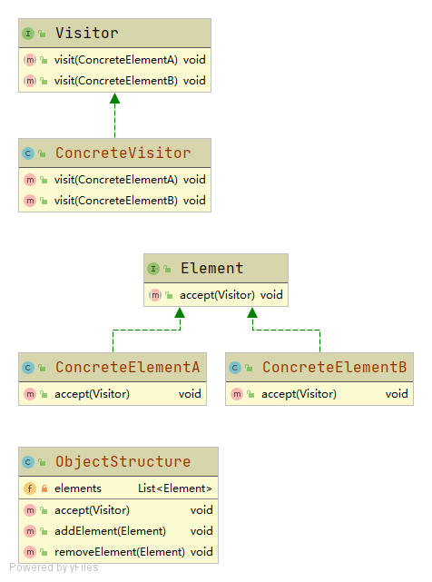

# 访问者模式

提供一个作用于某对象结构中**各元素**的操作表示，使不改变各元素的类的前提下定义作用于这些元素的新操作。

## 角色

### Visitor 抽象访问者
定义了针对**每一种**具体元素类的访问操作

### ConcreteVisitor 具体访问者
具体实现了某个功能模块，对每种具体元素都有具体实现的访问操作

### Element 抽象元素
包含一个调用抽象访问者的方法accept(Visitor visitor);

### ConcreteElement 具体元素
具体元素实现了accept()方法，调用Visitor的中的多态方法

### ObjectStructure 对象结构
即存放元素的集合，提供遍历内部元素的方法

## 缺点
- 元素需要暴露给访问者细节，违反了迪米特法则
- 违背依赖倒置原则，访问者的不同方法直接依赖不同的元素而不是面向接口

